

# Floorra

### Design your dream house — from floor plan to 3D, in minutes.

Pick a shape, choose your rooms, and let the AI architect draw three complete house layouts for you. 
Then add doors, windows, materials and furniture, walk around it in 3D, and download real drawings.

**[Try it free at floorra.com →](https://floorra.com)**

<!--
  VIDEO: on github.com, click Edit on this README, delete this whole comment,
  and drag media/floorra-ad-720p.mp4 onto this spot. GitHub turns it into a
  player with sound.
-->

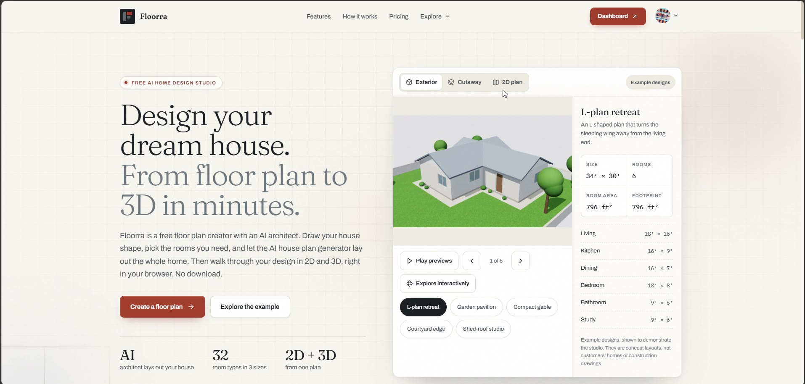

---

## Why Floorra

Most home design tools make you choose. **Drawing tools** give you total control, but you have to place every wall yourself. **AI generators** are quick, but they hand you a picture you can't change.

Floorra does both. Tell it what you need, get three real, fully editable house designs, and keep going until you have a complete home with finishes, furniture, a 3D model and a professional drawing set.

- **Nothing to install** — sign in and start designing.
- **Works in your browser** on any computer.
- **Real measurements** in feet and inches, from the outline down to every door.

---

## How it works

Floorra takes you through seven simple steps. You can go back to any step at any time; nothing is lost.

**Shape → Rooms → Layout → Doors & windows → Materials → Furnish & notes → Review**

### 1. Shape — the outline of your house

Browse dozens of ready-made house shapes (L, T, U, Z, courtyard and more), type your exact width and depth, or draw your own outline corner by corner. You see the size and floor area update as you go.

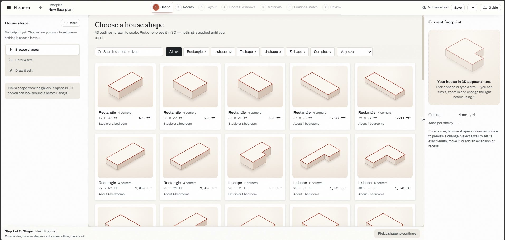

### 2. Rooms — everything you need

Choose from **32 room types**, each shown in 3D: bedrooms, bathrooms, closets, kitchen, dining, living, office, home gym, media room, garage, laundry, porch, deck, rooftop terrace and more. Set each one small, medium or large, or type your own size.

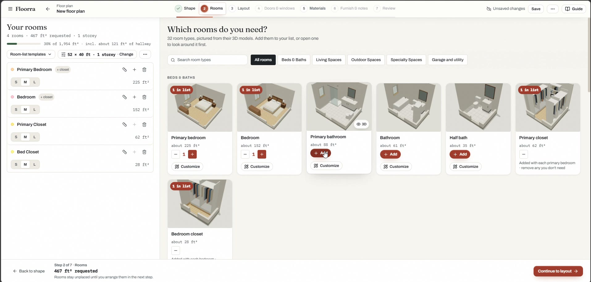

**Customize any room in 3D.** Open a room before it goes into your house: set its exact size by dragging its walls, rename it, change the lighting, and see it furnished.

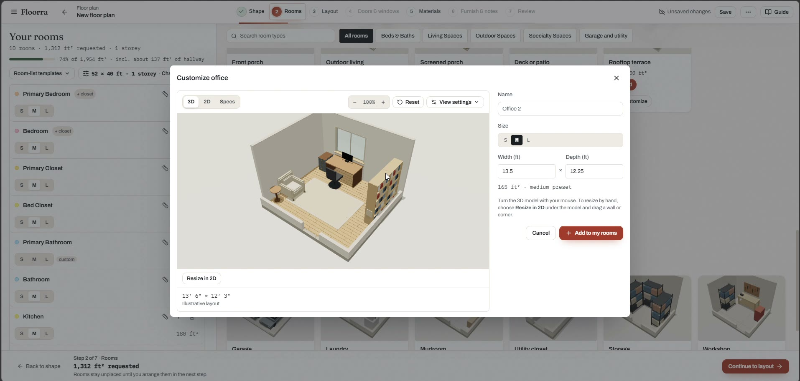

### 3. Layout — place rooms yourself, or let AI design it

Two ways to lay out your house:

- **Place them myself** — pick up a room, click the plan, then drag, resize or turn it.
- **Design it with the AI architect** — it reads your outline and every room you chose, then plans the whole house like an architect: quiet bedrooms, public rooms toward the street, the garage by the kitchen, and a hallway so every bedroom has its own door.

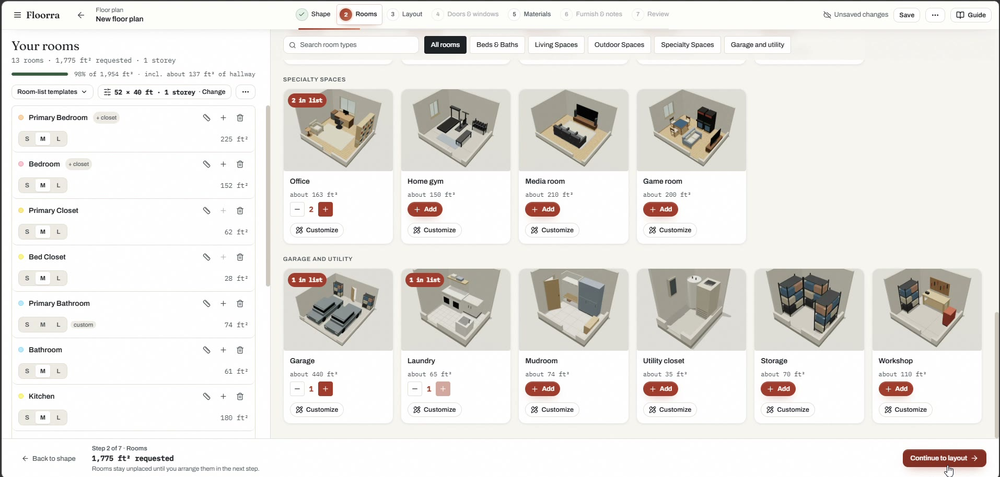

**Three complete designs in seconds.** The AI architect gives you three different layouts side by side. Look at each on the plan and in 3D, compare them, and keep your favourite. You can also tell it what you want ("office near the front door") and design again.

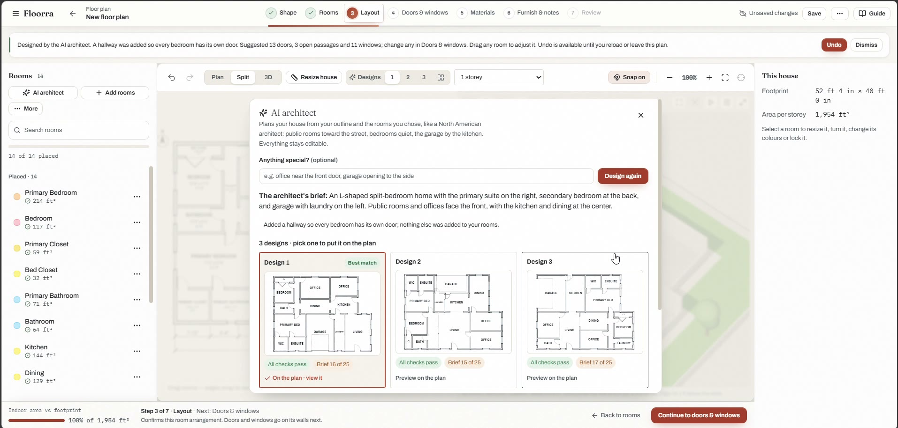

Every design stays editable: move any room, resize the whole house, change colors, lock the rooms you like.

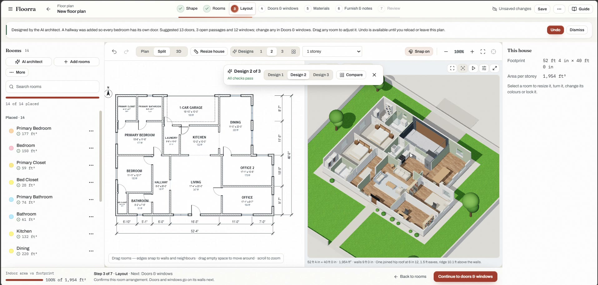

### 4. Doors & windows — from a real catalogue

Choose doors, windows and open passages from a catalogue: shaker, flush, six-panel, glass and more. Set the size, the hinge side, which way it opens, the frame and even the wood. Floorra checks each one fits the wall.

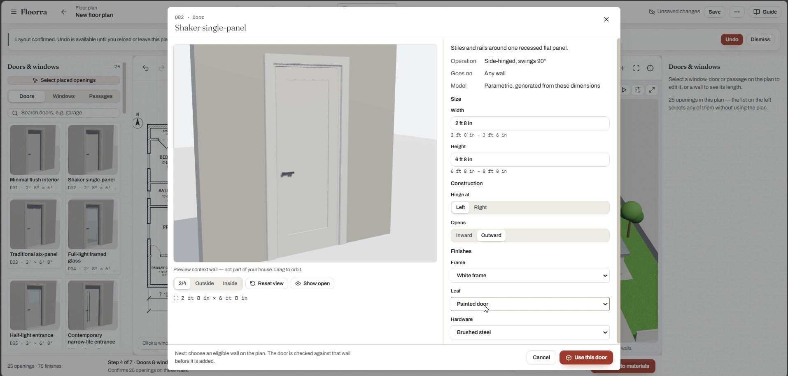

### 5. Materials — make it yours

Dress every surface: brick, stone, timber or plaster walls; slate, metal or clay-tile roofs; oak, carpet, tile or concrete floors; frames, doors and trim. Preview a finish before you apply it.

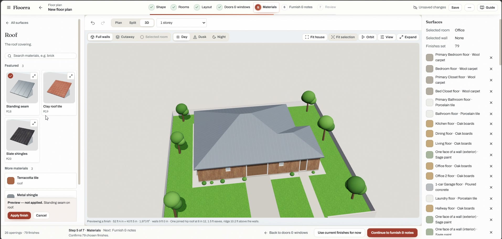

See the house in 3D with the roof on, or cut away to look inside every room.

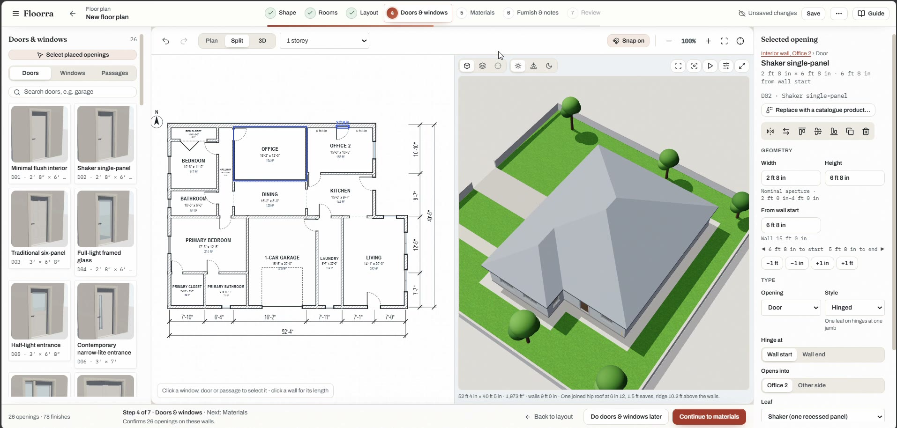

### 6. Furnish & notes

Add furniture from the library — beds, sofas, wardrobes, desks and more — and leave notes on the plan. Switch the light to day, dusk or night to see how your home feels.

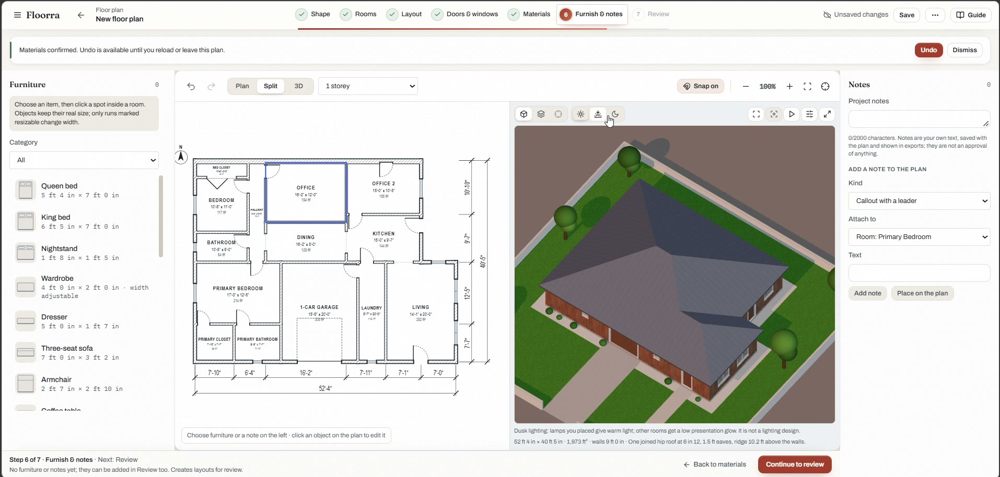

### 7. Review & download

Floorra checks your plan (every room placed, doors reachable, sizes as requested), then you download everything in one package.

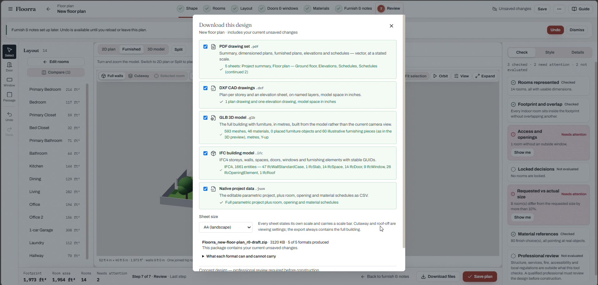

---

## What you can download

| File | What's inside |
|---|---|
| **PDF drawing set** | Project summary, dimensioned floor plan, furnished plan, four elevations and door, window and room schedules, drawn to scale |
| **DXF CAD drawings** | Plan and elevations on named layers, ready for CAD software |
| **GLB 3D model** | The full building with furniture, for 3D viewers and other design apps |
| **IFC building model** | Storeys, walls, spaces, doors and windows for BIM software |
| **Project data** | The editable project, with room, opening and material schedules as CSV |

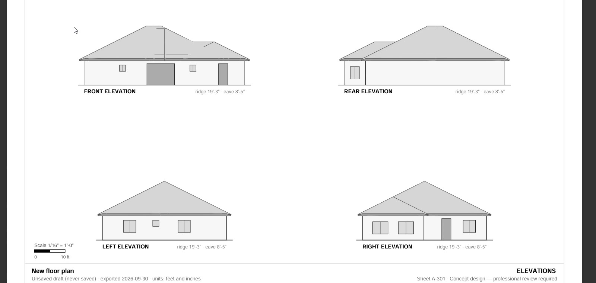

---

## Features at a glance

- **Three ways to set the outline:** browse shapes, type a size, or draw your own
- **32 room types**, each previewed in 3D
- **Customize any room in 3D** before placing it
- **AI architect:** three complete, editable house layouts in seconds
- **Place rooms yourself** with snapping, resizing and turning
- **Resize the whole house** by dragging its sides
- **Doors, windows and passages** from a catalogue, with sizes, hinges, frames and finishes
- **Materials** for walls, roofs, floors, ceilings, frames and doors
- **Furniture and notes** on the plan
- **Live 3D model** with cutaway, day, dusk and night lighting
- **Plan checks** for placement, access and requested sizes
- **Downloads:** PDF, DXF, GLB, IFC and project data
- **Undo** at every step

---

## Who it's for

- **Homeowners** planning a new build, an extension or a renovation
- **First-time buyers** who want to see a layout before talking to an architect
- **Designers and builders** who need quick concept plans for clients
- **Students** learning how houses are planned

---

## Coming soon

- Two- and three-storey houses

---

## FAQ

**Do I need to install anything?**
No. Floorra runs in your web browser.

**Can I change the AI's design?**
Yes. Every room, wall, door and finish stays editable after the AI architect designs it.

**Are the drawings ready for construction?**
Floorra produces concept designs. Structure, services and local building rules still need review by a qualified professional before you build.

---

## About this repository

> [!NOTE]
> **This is a promotional repository.** It showcases what Floorra does, with a video, screenshots and a feature walkthrough.
>
> Floorra's **source code is private** and is not included here. There is nothing to install or run from this repository — to use Floorra, visit **[floorra.com](https://floorra.com)**.
>
> The name, logo, screenshots and video are the property of Floorra and may not be reused without permission.

---

**[Start designing free at floorra.com](https://floorra.com)**

Questions or feedback: **[support@floorra.com](mailto:support@floorra.com)**

© 2026 Floorra. All rights reserved.

